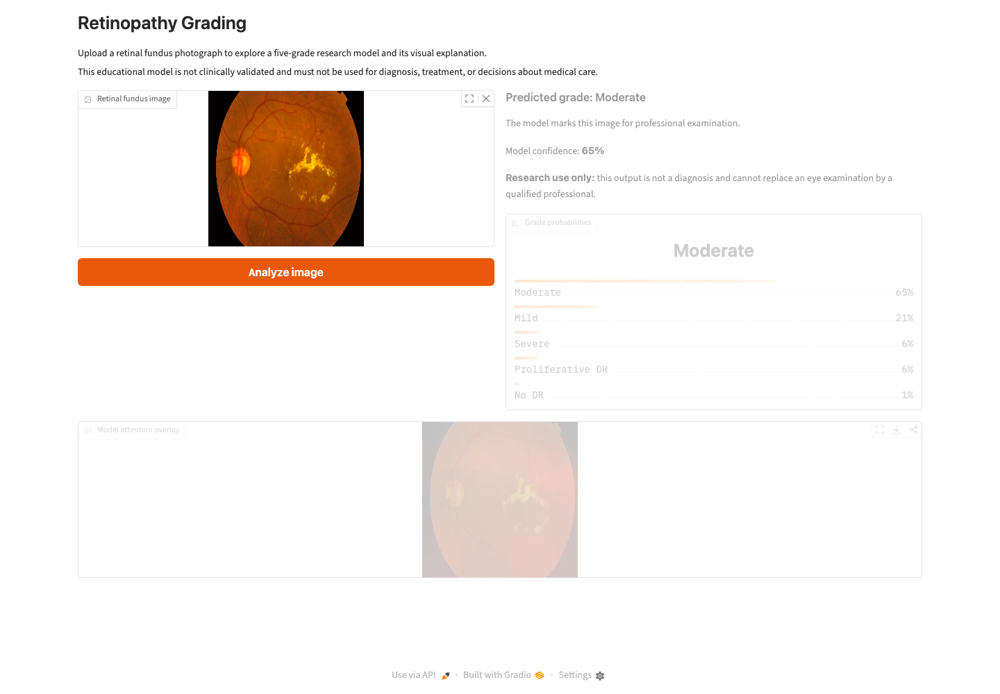
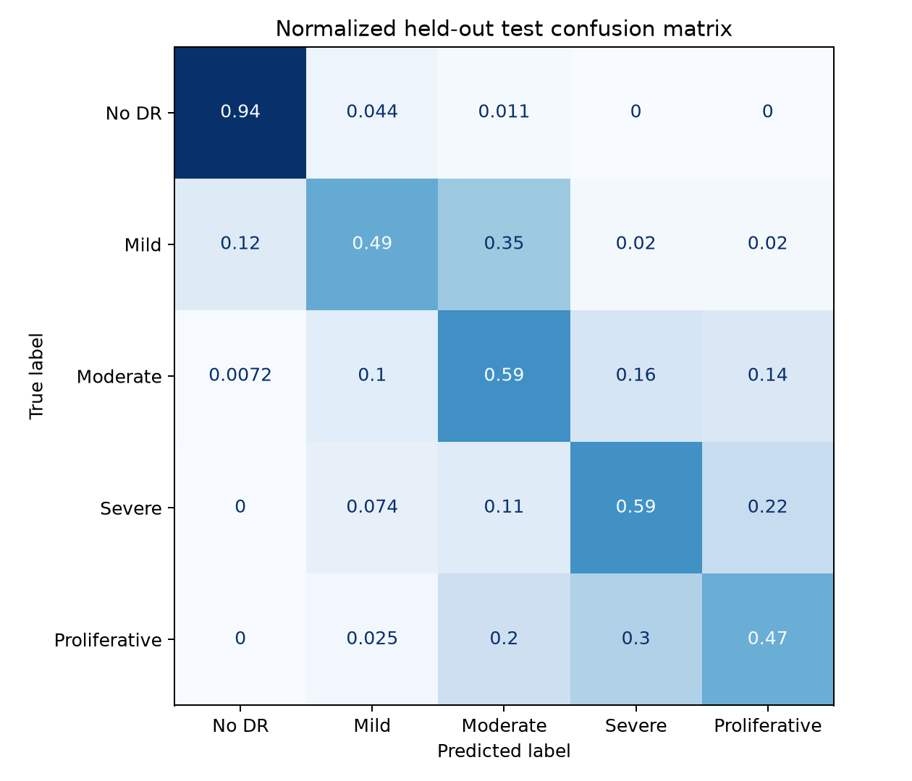

# Retinopathy Grading

Retinopathy Grading is a computer-vision study of diabetic-retinopathy severity in retinal fundus photographs. It predicts one of five ordered grades and derives a simpler referable-retinopathy screening result.

The repository includes the trained EfficientNet-B0 artifact, fixed dataset splits, calibration, held-out evaluation, Grad-CAM explanations, tests, and a local Gradio demo.

> **Research use only:** this model is not clinically validated and must not be used for diagnosis, treatment, or decisions about medical care.



## Results

The final checkpoint was selected using validation quadratic weighted kappa. Temperature scaling was fitted on the validation split, then the held-out test split was evaluated once.

| Held-out metric | Result |
| --- | ---: |
| Quadratic weighted kappa | 0.866 |
| Macro F1 | 0.589 |
| Balanced accuracy | 0.619 |
| Referable-DR AUROC | 0.980 |
| Referable-DR sensitivity | 94.1% |
| Referable-DR specificity | 91.9% |
| Expected calibration error | 2.9% |
| Test images | 526 |

Exact five-grade prediction is hardest for the smaller mild, severe, and proliferative classes. The binary screening result is substantially stronger than the exact-grade result, so the interface keeps those outputs separate.



## Prediction task

| Grade | Label |
| ---: | --- |
| 0 | No diabetic retinopathy |
| 1 | Mild |
| 2 | Moderate |
| 3 | Severe |
| 4 | Proliferative diabetic retinopathy |

Grades 2–4 are grouped as referable diabetic retinopathy for the screening result.

## Dataset controls

The project uses the CC0 [Diabetic Retinopathy 224×224 dataset](https://www.kaggle.com/datasets/sovitrath/diabetic-retinopathy-224x224-2019-data), derived from APTOS 2019.

Before splitting:

- 3,662 images were scanned
- exact hashes were computed
- 251 duplicate rows were detected
- 30 hashes with conflicting labels were excluded entirely
- 3,504 unique, non-conflicting images remained

The committed split manifest contains 2,452 training, 526 validation, and 526 test images. Dataset images are not committed.

## Run the demo

```bash
python -m venv .venv
source .venv/bin/activate
pip install -r requirements.txt
pip install -e .
python app.py
```

The interface returns:

- the predicted five-level grade
- referable or non-referable screening result
- calibrated confidence and a low-confidence warning
- probability distribution across all grades
- a Grad-CAM overlay showing influential retinal regions

## Reproduce training

Install development dependencies:

```bash
pip install -r requirements-dev.txt
pip install -e .
```

Download the public dataset:

```bash
python scripts/download_data.py
```

Prepare leakage-checked splits:

```bash
python scripts/prepare_data.py --dataset-root /path/to/dataset/version
```

Train and evaluate:

```bash
python scripts/train_model.py --dataset-root /path/to/dataset/version
```

The same commands work in a free Kaggle notebook with a GPU enabled. The baseline configuration is in `configs/baseline.yaml`.

## Repository structure

```text
app.py                    Gradio interface
artifacts/                metrics and evaluation figures
configs/                  reproducible training configuration
data/splits/              fixed split manifest; no retinal images
models/                   trained EfficientNet-B0 artifact
scripts/                  download, preparation, and training commands
src/retinopathy/          data, model, evaluation, calibration, and explanation code
tests/                    unit and smoke tests
```

## Limitations

- The dataset is relatively small and heavily imbalanced.
- Exact duplicates and conflicting labels indicate real annotation-quality limits.
- The split is image-level because patient identifiers are not supplied in this derivative.
- Performance has not been validated on another hospital, camera system, demographic group, or prospective clinical workflow.
- Grad-CAM indicates influential image regions; it does not prove medically correct reasoning.
- A qualified eye-care professional must interpret retinal findings.

More detail is available in [MODEL_CARD.md](MODEL_CARD.md).
