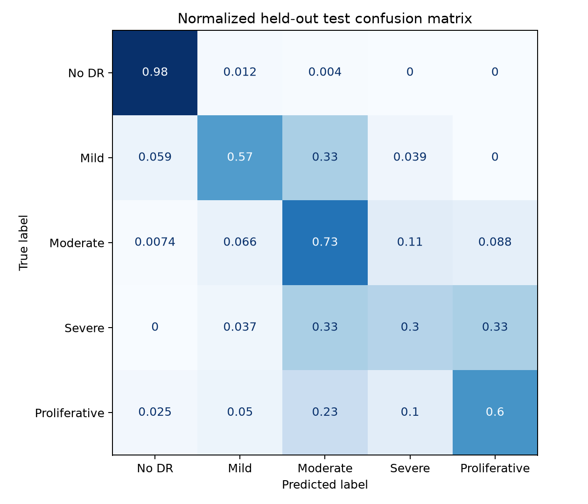

# Retinopathy Grading

Retinopathy Grading is a computer-vision study of diabetic-retinopathy severity in retinal fundus photographs. It predicts one of five ordered grades and derives a simpler referable-retinopathy screening result.

The repository includes a trained ordinal EfficientNet-B0 artifact, fixed dataset splits,
image-quality checks, calibration, internal and external evaluation, Grad-CAM
explanations, tests, and a local Gradio demo.

> **Research use only:** this model is not clinically validated and must not be used for diagnosis, treatment, or decisions about medical care.


## Results

The final checkpoint starts from the APTOS ordinal model and adds three epochs of
class-aware fine-tuning with IDRiD's official training split. Checkpoint selection and
temperature scaling use the unchanged APTOS validation split. The 95% QWK intervals use
1,000 bootstrap samples.

| Metric | APTOS test | IDRiD official test |
| --- | ---: | ---: |
| Quadratic weighted kappa | 0.881 (95% CI 0.849–0.909) | 0.731 (95% CI 0.590–0.847) |
| Macro F1 | 0.635 | 0.567 |
| Balanced accuracy | 0.635 | 0.575 |
| Referable-DR AUROC | 0.981 | 0.931 |
| Referable-DR sensitivity | 93.6% | 85.9% |
| Referable-DR specificity | 92.6% | 87.2% |
| Expected calibration error | 2.5% | 13.5% |
| Images | 501 | 103 |

Fine-tuning raised severe-grade recall on the IDRiD test split from 10.5% (2/19) to 84.2%
(16/19), while APTOS severe recall fell from 37.0% to 29.6%. The candidate met the
predeclared guardrails: APTOS QWK fell by 0.014 and referable AUROC by 0.003. These
results show a cross-dataset tradeoff, not a clinical performance claim.



## Prediction task

| Grade | Label |
| ---: | --- |
| 0 | No diabetic retinopathy |
| 1 | Mild |
| 2 | Moderate |
| 3 | Severe |
| 4 | Proliferative diabetic retinopathy |

Grades 2–4 are grouped as referable diabetic retinopathy for the screening result.

## Dataset controls

Labels and fixed splits come from the CC0
[Diabetic Retinopathy 224×224 dataset](https://www.kaggle.com/datasets/sovitrath/diabetic-retinopathy-224x224-2019-data),
derived from APTOS 2019. Training uses the corresponding higher-resolution images from
the Apache-2.0
[APTOS 2019 JPG dataset](https://www.kaggle.com/datasets/subhajeetdas/aptos-2019-jpg).

Before splitting:

- 3,662 images were scanned
- exact hashes were computed
- 251 duplicate rows were detected
- 30 hashes with conflicting labels were excluded entirely
- 3,504 unique, non-conflicting images remained

The high-resolution files use different names, so they were linked to the cleaned
low-resolution records using a deliberately strict procedure:

- crop the retinal field and compute a perceptual hash
- require mutual nearest-neighbour matching
- accept only a Hamming distance of 10 or less
- require agreement with the independent binary DR/no-DR directory label

This retained 3,201 matches: 2,227 training, 473 validation, and 501 test images. Binary
label agreement was 100%. The committed manifest makes the match auditable; dataset
images are not committed.

Fine-tuning also uses the 413-image official training split from
[IDRiD](https://ieee-dataport.org/open-access/indian-diabetic-retinopathy-image-dataset-idrid)
(CC BY 4.0), including 74 severe-grade images. All 103 official testing images remain
outside training, checkpoint selection, and calibration.

## Run the demo

```bash
python -m venv .venv
source .venv/bin/activate
pip install -r requirements.txt
pip install -e .
python app.py
```

The interface first rejects images that do not resemble a usable retinal photograph,
then returns:

- the predicted five-level grade
- referable or non-referable screening result
- calibrated confidence and a low-confidence warning
- probability distribution across all grades
- a Grad-CAM overlay showing influential retinal regions

## Reproduce training

Install development dependencies:

```bash
pip install -r requirements-dev.txt
pip install -e .
```

Download the public dataset:

```bash
python scripts/download_data.py
```

Prepare leakage-checked splits:

```bash
python scripts/prepare_data.py --dataset-root /path/to/dataset/version
```

Build the high-resolution manifest:

```bash
python scripts/match_high_resolution.py \
  --low-resolution-root /path/to/224-dataset \
  --high-resolution-root /path/to/high-resolution-dataset
```

Train and evaluate the ordinal model:

```bash
python scripts/train_ordinal_model.py \
  --image-directory /path/to/high-resolution-dataset
```

Fine-tune with the official IDRiD training split:

```bash
python scripts/finetune_idrid.py \
  --idrid-root /path/to/idrid \
  --aptos-root /path/to/high-resolution-dataset
```

Compare the original and fine-tuned checkpoints:

```bash
python scripts/compare_checkpoints.py \
  --idrid-root /path/to/idrid \
  --aptos-root /path/to/high-resolution-dataset
```

The same commands work in a free Kaggle notebook with a GPU enabled. Fine-tuning is
configured in `configs/idrid_finetune.yaml`; the original ordinal and 224px baseline
configurations remain available.

## Repository structure

```text
app.py                    Gradio interface
artifacts/                metrics and evaluation figures
configs/                  reproducible training configuration
data/splits/              fixed split manifest; no retinal images
models/                   trained EfficientNet-B0 artifact
scripts/                  download, preparation, and training commands
src/retinopathy/          data, model, evaluation, calibration, and explanation code
tests/                    unit and smoke tests
```

## Limitations

- The dataset is relatively small and heavily imbalanced.
- Exact duplicates and conflicting labels indicate real annotation-quality limits.
- The split is image-level because patient identifiers are not supplied in this derivative.
- Severe-grade recall differs sharply between APTOS (29.6%, 8/27) and IDRiD (84.2%,
  16/19).
- The IDRiD test set contains only 19 severe-grade images, so its recall estimate has high
  uncertainty.
- Calibration still changes across datasets: ECE is 2.5% on APTOS and 13.5% on IDRiD.
- Image-quality thresholds are engineering safeguards, not clinically validated quality
  assessment.
- Performance has not been tested prospectively or in a clinical workflow.
- Grad-CAM indicates influential image regions; it does not prove medically correct reasoning.
- A qualified eye-care professional must interpret retinal findings.

More detail is available in [MODEL_CARD.md](MODEL_CARD.md).
